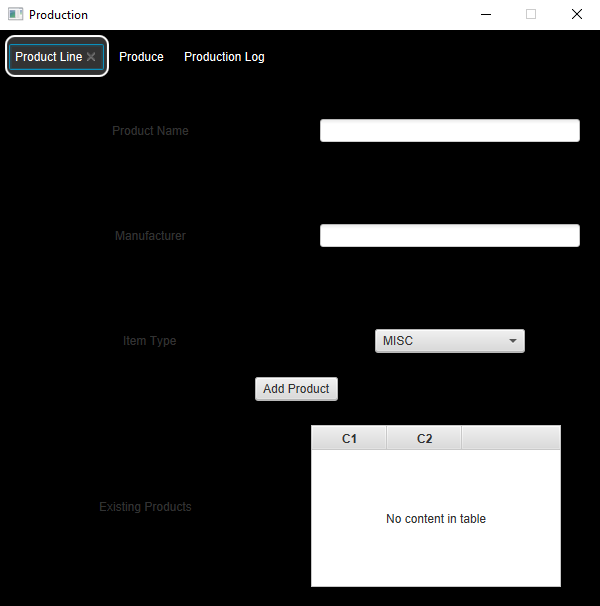

# Production
Semester long project (Devin Arena) that allows you to keep track of products, create new products, and logs production

## Alpha Release
* Added H2 database support
* Added function to some of the UI elements
* So far you can add products using the produce line tab and doing so prints a list of all products to the console

## Beta Release
* More database functionality
* More UI functionality
* So far you can add products using the produce line tab and log production of these items in the produce tab.
* Functionality is not complete yet and some things are just for testing.

